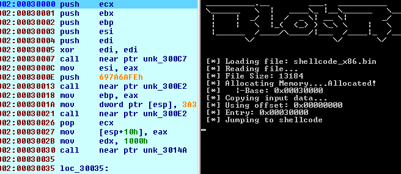

[](https://discord.gg/cw4U3WHvpn) [](https://www.patreon.com/oalabs)

# BlobRunner 

BlobRunner is a simple tool to quickly debug shellcode extracted during malware analysis.  
BlobRunner allocates memory for the target file and jumps to the base (or offset) of the allocated memory. This allows
an analyst to quickly debug into extracted artifacts with minimal overhead and effort. 



To use BlobRunner, you can download the compiled executable from the [releases](https://github.com/OALabs/BlobRunner/releases) page or build your own using the steps below.

## Building
Building the executable is straight forward and relatively painless. 

### Windows
__Requirements__
 - Download and install Microsoft Visual C++ Build Tools or Visual Studio 
 
__Build Steps__

 - Open Visual Studio Command Prompt 
 - Navigate to the directory where BlobRunner is checked out
 - Build the executable by running: 
 ```
 cl blobrunner.c
 ```


#### Building BlobRunner x64
 
Building the x64 version is virtually the same as above, but simply uses the x64 tooling. 
 - Open x64 Visual Studio Command Prompt 
 - Navigate to the directory where BlobRunner is checked out
 - Build the executable by running: 
 
  ```
   cl /Feblobrunner64.exe /Foblobrunner64.out blobrunner.c
  ```

## Usage

To debug: 

 - Open BlobRunner in your favorite debugger.
 - Pass the shellcode file as the first parameter. 
 - Add a breakpoint before the jump into the shellcode 
 - Step into the shellcode 
 
```
BlobRunner.exe shellcode.bin
```

Debug into file at a specific offset.

```
BlobRunner.exe shellcode.bin --offset 0x0100
```

Debug into file and don't pause before the jump. __Warning:__ Ensure you have a breakpoint set before the jump.

```
BlobRunner.exe shellcode.bin --nopause
```

#### Just-In-Time (JIT) Debugger 

The optional parameter `--jit` can be used to debug the shell code with the configured Just-In-Time (JIT) debugger. 
To trigger the debugger - BlobRunner removes execute access from the newly allocated memory region. This causes the program to raise 
an AccessViolation (0xC0000005) exception when attempting to execute the loaded shellcode. 

Instructions for configuring the JIT debugger on windows can be found [here](https://docs.microsoft.com/en-us/windows/win32/debug/configuring-automatic-debugging). 
For x64Dbg see [setjit](https://help.x64dbg.com/en/latest/commands/misc/setjit.html) or [setjitauto](https://help.x64dbg.com/en/latest/commands/misc/setjitauto.html). 

Example: 
```
BlobRunner.exe shellcode.bin --jit
```

Once the debugger is loaded grant executable access to the region. Using [x64Dbg](https://x64dbg.com/#start) you can execute the command [setpagerights](https://help.x64dbg.com/en/latest/commands/memory-operations/setpagerights.html)
using the address returned by BlobRunner.

```
setpagerights <region>, ExecuteReadWrite
```

#### Debugging x64 Shellcode

Inline assembly [isn't supported](https://msdn.microsoft.com/en-us/library/wbk4z78b.aspx) by the x64 compiler, so to support debugging x64 shellcode the loader
creates a suspended thread which allows you to place a breakpoint at the thread entry, before the thread is resumed.

#### Remote Debugging Shell Blobs (IDAPro)

The process is virtually identical to debugging shellcode locally - with the exception that the you need to copy the shellcode file
to the remote system. If the file is copied to the same path you are running _win32_remote.exe_ from, you need to use
the file name for the parameter. Otherwise, you will need to specify the path to the shellcode file on the remote system.

## Shellcode Samples  

You can quickly generate shellcode samples using the Metasploit tool [msfvenom](https://github.com/rapid7/metasploit-framework/wiki/How-to-use-msfvenom).

Generating a simple Windows exec payload. 

```
msfvenom -a x86 --platform windows -p windows/exec cmd=calc.exe -o test2.bin
```

## Feedback / Help

 - Any questions, comments or requests you can find us on twitter: @seanmw or @herrcore
 - Pull requests welcome! 
